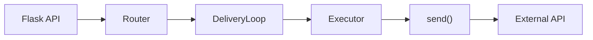
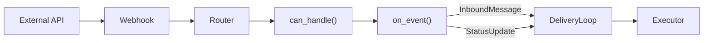
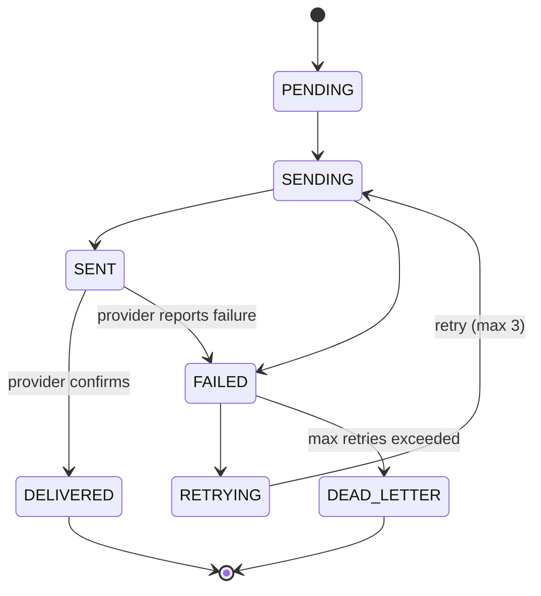

# Connector Protocol - Developer Integration Guide

This guide explains how to build a connector backend for wazo-chatd. A connector is a bridge between wazo-chatd's room messaging system and an external messaging provider (SMS gateways, WhatsApp Business API, email services, etc.).

## Overview

Connectors are discovered at startup via [stevedore](https://docs.openstack.org/stevedore/) entry points. They are installed as separate Debian packages and have zero coupling to wazo-chatd internals. The connector only needs to implement a Python protocol - no HTTP, no Flask, no database access.

### How it works

**Outbound** (user sends a message):



**Inbound** (external message or status callback arrives):



Your connector handles three things:
1. **Sending** messages to an external API
2. **Receiving** messages from an external API (webhooks, polling, or websockets)
3. **Mapping delivery statuses** from the provider's status strings to wazo-chatd's internal delivery states

Everything else (persistence, delivery tracking, retries, bus events) is handled by wazo-chatd.

## The Connector Protocol

Your connector class must implement the following interface. See `wazo_chatd.connectors.connector.Connector` for the full Protocol definition.

### Class attributes

```python
from typing import ClassVar

from wazo_chatd.connectors.delivery import DeliveryStatus

class MyConnector:
    backend: ClassVar[str] = 'my-provider'
    supported_types: ClassVar[tuple[str, ...]] = ('sms', 'mms')
    status_map: ClassVar[dict[str, DeliveryStatus]] = {
        'sent': DeliveryStatus.SENT,
        'delivered': DeliveryStatus.DELIVERED,
        'failed': DeliveryStatus.FAILED,
    }
```

| Attribute | Description |
|-----------|-------------|
| `backend` | Unique identifier for your provider (e.g. `"my-sms-gateway"`, `"my-email-service"`) |
| `supported_types` | Tuple of messaging types this backend supports (e.g. `("sms", "mms", "whatsapp")`) |
| `status_map` | Mapping of provider status strings to `DeliveryStatus` enum values. Only statuses that should create a delivery record need to be mapped. Omit transient statuses (e.g. `"queued"`, `"sending"`) — the executor ignores unmapped statuses. Use an empty dict `{}` if your connector doesn't support status callbacks. |

### `configure(type_, provider_config, connector_config)`

Called once after instantiation. Receives two configuration sources:

```python
def configure(
    self,
    type_: str,
    provider_config: Mapping[str, Any],
    connector_config: Mapping[str, Any],
) -> None:
    self._type = type_
    self._api_key = provider_config['api_key']
    self._mode = str(connector_config.get('mode', 'webhook'))
```

| Parameter | Source | Example |
|-----------|--------|---------|
| `type_` | `ChatProvider.type_` | `"sms"`, `"whatsapp"` |
| `provider_config` | `ChatProvider.configuration` JSONB (per-tenant, managed by confd) | `{"api_key": "..."}` |
| `connector_config` | `/etc/wazo-chatd/conf.d/` (system-level) | `{"mode": "webhook", "polling_interval": 30}` |

### `send(message) -> str`

Send a message through your external API. Returns the provider's message ID.

```python
from wazo_chatd.connectors.exceptions import ConnectorSendError
from wazo_chatd.connectors.types import OutboundMessage

def send(self, message: OutboundMessage) -> str:
    try:
        result = self._client.messages.create(
            to=message.recipient_alias,
            body=message.body,
            from_=message.sender_alias,
        )
        return result.id
    except ProviderError as exc:
        raise ConnectorSendError(str(exc)) from exc
```

**Key points:**
- Raise `ConnectorSendError` on failure - wazo-chatd handles retries
- Return the external message ID as a string
- Can be sync or async. Sync implementations are automatically wrapped with `asyncio.to_thread()`
- `message.metadata` may contain `idempotency_key` - pass it to the provider if supported

**OutboundMessage fields:**

| Field | Type | Description |
|-------|------|-------------|
| `room_uuid` | `str` | Room this message belongs to |
| `message_uuid` | `str` | Unique message identifier |
| `sender_uuid` | `str` | Wazo user UUID of the sender |
| `body` | `str` | Message content |
| `sender_alias` | `str` | Sender's external identity (e.g. `"+15551234"`) |
| `recipient_alias` | `str` | Recipient's external identity |
| `metadata` | `Mapping` | Extra data including optional `idempotency_key` |

### Transport types

Instead of a transport string, wazo-chatd uses typed dataclasses to carry transport-specific metadata. The base class `TransportData` has no required fields — each subclass defines its own structure.

wazo-chatd provides `WebhookData` for HTTP webhooks. Connector developers can subclass `TransportData` for custom transports (UDP, AMQP, etc.).

| Type | Fields | Description |
|------|--------|-------------|
| `WebhookData` | `body`, `headers`, `content_type` | HTTP webhook request |
| `TransportData` | *(none)* | Base class — subclass for custom transports |

Use structural pattern matching to dispatch by transport type:

```python
match data:
    case WebhookData(body=body, headers=headers):
        ...handle HTTP webhook...
    case MyCustomTransport(source=source):
        ...handle custom transport...
```

### `can_handle(data) -> bool`

Cheap pre-filter called before `on_event()`. Inspect transport-specific metadata to quickly determine if this event is for your connector.

```python
from wazo_chatd.connectors.types import TransportData, WebhookData

def can_handle(self, data: TransportData) -> bool:
    match data:
        case WebhookData(headers=headers):
            return 'X-My-Provider-Signature' in headers
        case _:
            return True
```

**When called:** Before `on_event()`, during webhook dispatch. Multiple connectors may be registered; `can_handle` avoids calling `on_event()` on connectors that clearly don't match.

**What to check:** Headers, content-type, or any cheap signal. Do NOT do full parsing or signature validation here.

### `on_event(data) -> InboundMessage | StatusUpdate | None`

Parse an incoming event into an `InboundMessage` (new message), `StatusUpdate` (delivery status change), or `None` (irrelevant event).

Many providers send both message webhooks and status callbacks to the same URL. Your connector decides the type based on the payload.

**Using structural pattern matching (recommended):**

```python
from wazo_chatd.connectors.types import InboundMessage, StatusUpdate, TransportData, WebhookData

def on_event(self, data: TransportData) -> InboundMessage | StatusUpdate | None:
    match data:
        case WebhookData(body=body):
            return self._parse_webhook(body)
        case _:
            return None
```

**Using isinstance (alternative):**

```python
def on_event(self, data: TransportData) -> InboundMessage | StatusUpdate | None:
    if isinstance(data, WebhookData):
        return self._parse_webhook(data.body)
    return None
```

Both approaches are equivalent. Pattern matching is more expressive when handling multiple transport types.

**Parsing example:**

```python
def _parse_webhook(self, body):
    content = body.get('body')
    if content:
        return InboundMessage(
            sender=body['from'],
            recipient=body['to'],
            body=content,
            backend=self.backend,
            external_id=body['message_id'],
            metadata={
                'idempotency_key': body.get('idempotency_token', ''),
            },
        )

    status = body.get('message_status')
    message_id = body.get('message_id')
    if status and message_id:
        return StatusUpdate(
            external_id=message_id,
            status=status,
            backend=self.backend,
            error_code=body.get('error_code', ''),
        )

    return None
```

**Signature validation** is your responsibility. Verify the webhook signature inside `on_event()` and return `None` if invalid.

**Idempotency:** If the provider supplies a deduplication key, include it as `idempotency_key` in `InboundMessage.metadata`. wazo-chatd uses this to prevent duplicate message ingestion via a GIN-indexed JSONB lookup.

**InboundMessage fields:**

| Field | Type | Description |
|-------|------|-------------|
| `sender` | `str` | External identity of the sender |
| `recipient` | `str` | External identity of the recipient |
| `body` | `str` | Message content |
| `backend` | `str` | Your backend name (must match `cls.backend`) |
| `external_id` | `str` | Provider's message ID |
| `metadata` | `Mapping` | Extra data, including optional `idempotency_key` |

**StatusUpdate fields:**

| Field | Type | Description |
|-------|------|-------------|
| `external_id` | `str` | Provider's message ID that this status refers to |
| `status` | `str` | Provider-specific status string (mapped via `status_map`) |
| `backend` | `str` | Your backend name |
| `error_code` | `str` | Provider error code if delivery failed (empty otherwise) |
| `metadata` | `Mapping` | Provider-specific extra data |

### `normalize_identity(raw_identity) -> str`

Normalize an external identity to its canonical form. Used for capability resolution: if this method succeeds for a given identity, your connector type can reach that participant.

```python
import re

_E164 = re.compile(r'^\+[1-9]\d{6,14}$')

def normalize_identity(self, raw_identity: str) -> str:
    if _E164.match(raw_identity):
        return raw_identity
    raise ValueError(f'Not a valid phone number: {raw_identity}')
```

Raise `ValueError` if the identity doesn't match your connector's expected format. This is how wazo-chatd determines which connectors can reach which participants.

### `listen(on_message)` and `stop()`

For connectors that use polling or websockets instead of webhooks.

```python
from wazo_chatd.connectors.types import PollData

def listen(self, on_message: Callable[[InboundMessage], None]) -> None:
    # For webhook-only connectors: no-op
    pass

def stop(self) -> None:
    pass
```

For polling connectors, `listen()` runs a loop that wraps polled data in the appropriate `TransportData` subclass:

```python
@dataclass(frozen=True)
class PollData(TransportData):
    body: Mapping[str, Any]

def listen(self, on_message: Callable[[InboundMessage], None]) -> None:
    while not self._stopped:
        messages = self._client.poll_new_messages()
        for msg in messages:
            result = self.on_event(PollData(body=msg))
            if isinstance(result, InboundMessage):
                on_message(result)
        time.sleep(self._polling_interval)

def stop(self) -> None:
    self._stopped = True
```

For webhook-only connectors, both methods are no-ops. The connector defines its own `TransportData` subclass for non-webhook transports.

## Packaging and Discovery

### Entry point registration

Register your connector via setuptools entry points in `pyproject.toml`:

```toml
# pyproject.toml
[project.entry-points."wazo_chatd.connectors"]
my-provider = "wazo_chatd_connector_myprovider.connector:MyConnector"
```

The entry point name should match your `backend` class attribute.

### Package structure

```text
wazo-chatd-connector-myprovider/
    pyproject.toml
    wazo_chatd_connector_myprovider/
        __init__.py
        connector.py      # MyConnector class
```

### Installation

```bash
apt install wazo-chatd-connector-myprovider
# or during development:
pip install -e ./wazo-chatd-connector-myprovider
```

wazo-chatd discovers installed connectors at startup via stevedore. No configuration changes needed in wazo-chatd itself.

## Configuration: Providers and User Aliases

For a connector to function, two configuration resources must exist in the system:

### ChatProvider

A `ChatProvider` represents a configured instance of a messaging backend for a tenant. It is managed via the wazo-confd API and cached locally by wazo-chatd.

| Field | Description |
|-------|-------------|
| `uuid` | Unique provider identifier |
| `tenant_uuid` | Which tenant owns this provider |
| `type_` | Messaging type: `sms`, `whatsapp`, `email`, etc. |
| `backend` | Which connector backend handles this provider (must match your `backend` class attribute) |
| `name` | Human-readable name (e.g. "Production SMS") |
| `configuration` | JSONB dict of provider-specific credentials and settings (passed to `configure()` as `provider_config`) |

A single backend can have multiple providers (e.g. separate SMS accounts for different tenants).

### UserAlias

A `UserAlias` maps a Wazo user to an external identity through a provider. It determines which phone number, email address, or handle a user sends from.

| Field | Description |
|-------|-------------|
| `uuid` | Unique alias identifier |
| `user_uuid` | The Wazo user this alias belongs to |
| `provider_uuid` | Which `ChatProvider` this alias is associated with |
| `identity` | The external identity string (e.g. `"+15551234567"`, `"user@example.com"`) |

When sending an outbound message, the executor resolves the sender's `UserAlias` to determine:
- The `sender_alias` (the "from" identity passed to `send()`)
- The `backend` and `type` (which connector to use)

### End-to-end setup

To send and receive messages through your connector:

1. Install your connector package (`apt install` or `pip install -e`)
2. Enable it in `/etc/wazo-chatd/conf.d/connectors.yml`
3. Create a `ChatProvider` via wazo-confd with your backend name and credentials
4. Create `UserAlias` records linking Wazo users to external identities
5. Configure your provider to send webhooks to `POST /connectors/incoming`

### Enabling/disabling

Backends are controlled via wazo-chatd configuration:

```yaml
# /etc/wazo-chatd/conf.d/connectors.yml
enabled_connectors:
  my-provider: true
  internal: true  # always enabled by default
```

## Webhook Configuration

wazo-chatd exposes two webhook endpoints for inbound messages:

- `POST /connectors/incoming` - generic, tries all connectors
- `POST /connectors/incoming/<backend>` - backend hint for faster matching

Configure your external provider to send webhooks to either URL. The `<backend>` path is a convenience hint that prioritizes matching connectors but falls back to trying all registered connectors if no match is found.

The dispatch flow:
1. HTTP request is extracted into a `WebhookData(body=..., headers=..., content_type=...)`
2. `can_handle(data)` is called on each connector (hint-matched first)
3. First connector returning `True` gets `on_event(data)` called
4. If `on_event` returns an `InboundMessage` or `StatusUpdate`, it's enqueued for processing
5. If it returns `None`, the next matching connector is tried

## Delivery Lifecycle

Understanding the delivery lifecycle helps when implementing `send()` and `status_map`:



**Outbound flow:**
1. `PENDING` — meta created by the sync side when the message is sent
2. `SENDING` — executor picked up the message, calling `connector.send()`
3. `SENT` — `send()` returned successfully with an external message ID
4. Provider sends status callbacks → `StatusUpdate` → mapped via `status_map`
5. `DELIVERED` / `FAILED` — provider confirms final delivery status

**Your connector's role:**
- `send()` — raise `ConnectorSendError` on transient failures (wazo-chatd retries automatically), return the external message ID on success
- `status_map` — map your provider's status strings to `DeliveryStatus` values
- wazo-chatd publishes `chatd_message_delivery_status` bus events on each state transition

## Complete Example

> [!NOTE]
> This example is for reference only and has not been tested. It illustrates the expected structure and method signatures for a connector implementation.

```python
from __future__ import annotations

import re
from collections.abc import Callable, Mapping
from typing import Any, ClassVar

from wazo_chatd.connectors.delivery import DeliveryStatus
from wazo_chatd.connectors.exceptions import ConnectorSendError
from wazo_chatd.connectors.types import (
    InboundMessage,
    OutboundMessage,
    StatusUpdate,
    TransportData,
    WebhookData,
)

_E164 = re.compile(r'^\+[1-9]\d{6,14}$')


class MySmsConnector:
    backend: ClassVar[str] = 'my-sms-gateway'
    supported_types: ClassVar[tuple[str, ...]] = ('sms',)
    status_map: ClassVar[dict[str, DeliveryStatus]] = {
        'sent': DeliveryStatus.SENT,
        'delivered': DeliveryStatus.DELIVERED,
        'failed': DeliveryStatus.FAILED,
        'rejected': DeliveryStatus.FAILED,
    }

    def __init__(self) -> None:
        self._api_key: str = ''
        self._api_secret: str = ''
        self._client = None  # Provider SDK client instance

    def configure(
        self,
        type_: str,
        provider_config: Mapping[str, Any],
        connector_config: Mapping[str, Any],
    ) -> None:
        self._api_key = provider_config.get('api_key', '')
        self._api_secret = provider_config.get('api_secret', '')
        # Initialize your SDK client here

    def send(self, message: OutboundMessage) -> str:
        try:
            response = self._client.sms.send_message({
                'from': message.sender_alias,
                'to': message.recipient_alias,
                'text': message.body,
            })
            return response['messages'][0]['message-id']
        except Exception as exc:
            raise ConnectorSendError(str(exc)) from exc

    def can_handle(self, data: TransportData) -> bool:
        match data:
            case WebhookData(headers=headers):
                return 'X-My-Provider-Signature' in headers
            case _:
                return True

    def on_event(
        self, data: TransportData
    ) -> InboundMessage | StatusUpdate | None:
        match data:
            case WebhookData(body=body):
                return self._parse_webhook(body)
            case _:
                return None

    def _parse_webhook(self, body):
        content = body.get('text')
        if content:
            return InboundMessage(
                sender=body.get('from', ''),
                recipient=body.get('to', ''),
                body=content,
                backend=self.backend,
                external_id=body.get('message_id', ''),
            )

        status = body.get('status')
        message_id = body.get('message_id')
        if status and message_id:
            return StatusUpdate(
                external_id=message_id,
                status=status,
                backend=self.backend,
                error_code=body.get('error_code', ''),
            )

        return None

    def listen(self, on_message: Callable[[InboundMessage], None]) -> None:
        pass

    def stop(self) -> None:
        pass

    def normalize_identity(self, raw_identity: str) -> str:
        if _E164.match(raw_identity):
            return raw_identity
        raise ValueError(f'Not a valid phone number: {raw_identity}')
```
